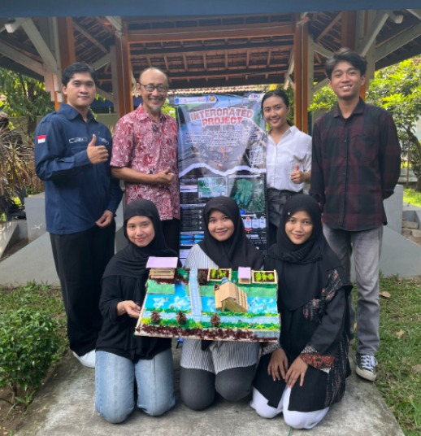
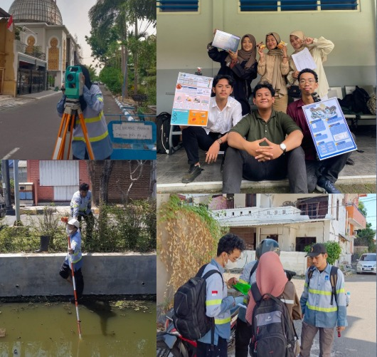
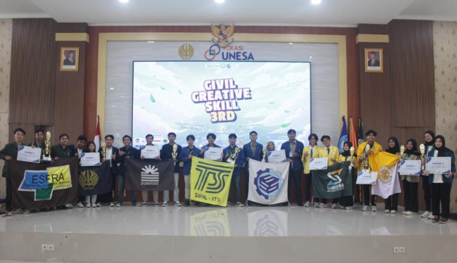

  

<h1 align="center">👷‍♀️ Siti Nur Halimah</h1>

💧 Water Infrastructure | 🏗️ Project Management | 🏢 Construction

<b>Civil Engineering | Water Infrastructure 💧</b>

---

## 🌊 About Me
Mahasiswa tingkat akhir Teknik Infrastruktur Sipil yang berfokus pada **infrastruktur air 💧, analisis hidrolika, dan manajemen proyek**.  
Berpengalaman dalam **analisis tekanan & debit, deteksi kebocoran, serta optimasi jaringan distribusi air berbasis data**.  

Selain itu, memiliki pengalaman dalam **quality control konstruksi, estimasi volume pekerjaan, dan koordinasi proyek lapangan**.  
Terbiasa bekerja secara **analitis, detail-oriented, dan kolaboratif dalam tim proyek**.

---

## 🎓 Education
**Institut Teknologi Sepuluh Nopember (ITS)**  
D4 Teknologi Rekayasa Konstruksi Bangunan Air  
2022 – Present  

**SMK Negeri 26 Jakarta**  
Konstruksi Gedung, Sanitasi, dan Perawatan  
2018 – 2022  

---

## 🚀 Portfolio & CV

---

## 💼 Internship Experience

### 💧 PAM JAYA – Water Distribution Internship
- Monitoring dan analisis **tekanan & debit jaringan distribusi air**  
- Identifikasi **kebocoran & tekanan rendah**  
- Analisis jaringan menggunakan **ArcGIS & data real-time**  
- Support operasional: flushing & valve checking  

### 🏗️ PT Wijaya Karya Bangunan Gedung (WIKA)
- Quality control pekerjaan arsitektur & finishing  
- Perhitungan volume pekerjaan dari shop drawing  
- Rekap data proyek & laporan mingguan  

---

## 🛠️ Tech Stack

---

## 🚧 Featured Projects

### 💧 Rehabilitasi Irigasi Tarum Utara Barat

  

➡️ Analisis sedimentasi & perancangan solusi teknis  

---

### 🌧️ Drainase Lembah Harapan

  

➡️ Analisis banjir & perencanaan sistem drainase  

---

### 🏗️ Lomba Tender Nasional

  

➡️ Penyusunan estimasi biaya, BOQ, dan scheduling  

---

## 🌐 Connect with Me

---

## 📫 Contact
📧 Email: **snhalimaah@gmail.com**  
